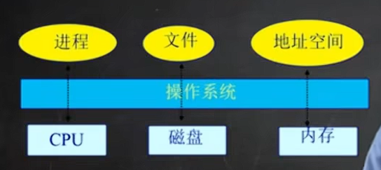

## 1.1. 什么是操作系统

- 用户角度层面，操作系统是控制软件：为用户提供一个接口，以操作计算机的底层部件，如通过声卡播放声音，通过网卡连接网络等

- 内部管理层面，操作系统是资源分配器：如何去分配不同时刻不同程序访问不同资源，提升计算机的效率

## 1.2. 常见的硬件资源

最常见的三块如**CPU、内存和磁盘**，常见的还有声卡网卡显卡，皆在操作系统管理范围之内。

- CPU调度

- 内存
  
  - 物理内存管理
  
  - 虚拟内存管理（在有限物理内存之下虚拟出更大的内存便于使用）

- 文件系统管理

- 中断处理和IO设备驱动（驱动完成上述的功能）

## 1.3. 操作系统的特征

四个：**并发、共享、虚拟、异步**，具体介绍如下

- 并发：一段时间内可以同时存在多个运行的程序，由操作系统负责调度选择哪个CPU来运行；注意术语中并发并行的区别：
  
  - **一段时间内**，有多个程序可以运行；单核CPU在不同时间点选择不同程序运行
  
  - **一个时间点**上有多个程序可以同时执行；一般需要多个CPU才能做到这一点

- 共享：
  
  - “同时”访问
  
  - 互斥共享，一个时间点上只有一个程序可以访问某一块资源

- 虚拟：更应该从“一台物理机器虚拟成多台机器，让多个用户感觉自己在独立享有一台计算机”的角度理解更合适，这就是多道程序设计技术
  
  - CPU虚拟化成内存
  
  - 磁盘虚拟化成文件
  
  - 内存虚拟化成地址空间

- 异步
  
  - 程序执行是走走停停的，向前推进速度不可知
  
  - 但只要运行环境相同，OS需要保证程序运行结果相同

## 1.X 个人QA

Q1: 多道程序设计技术是分时操作系统的基础，分时操作系统在现在的个人计算机中是否存在？

1. **现代操作系统的演变** 
   
   分时操作系统的核心特征（如时间片轮转、多用户交互）在**现代个人计算机操作系统（如Windows、Linux、macOS）中仍然存在**，但已不再是传统意义上的“纯分时系统”。这些系统通过**多任务调度机制**继承了分时系统的设计思想，例如：
   
   - **多用户支持**：允许多个用户通过终端或远程登录共享资源（如Linux服务器） 
   
   - **时间片轮转**：CPU时间被划分为微小的时间片，分配给不同进程以实现并发运行，用户感知为“同时执行多个任务” 
   
   - **交互性**：用户可实时与系统交互（如打开应用程序、输入命令），响应时间通常在毫秒级 
   
   但现代系统更强调**分页内存管理**和**抢占式多任务**，而非传统分时系统的纯分段式设计。例如，Windows和Linux通过虚拟内存技术将物理内存抽象为分页结构，同时通过优先级调度优化资源分配

2. **分时系统的实际应用场景**
   
   - **服务器领域**：Linux/Unix服务器仍体现分时特性，支持多用户远程登录并发操作 
   
   - **桌面系统**：个人计算机的“多任务”本质上是分时技术的延伸，例如同时运行浏览器、音乐播放器和编辑器 

3. 即使现在CPU是多核的，理论上而言多核CPU可以同时运行多个程序，但仍然需要时间片轮转，这是因为：
   
   - **核心资源有限性**：即使多核CPU有多个核心，当**同时运行的进程数超过核心数**时，仍需通过调度算法分配时间片。例如，若系统有4核但运行10个进程，仍需通过时间片轮转实现逻辑上的并发执行 
   
   - **I/O密集型任务的阻塞问题**：I/O密集型进程会频繁进入阻塞状态，导致核心空闲。通过时间片轮转，可在阻塞时快速切换其他就绪进程，避免资源浪费 
   
   - **公平性与优先级管理**：时间片轮转可防止单个进程独占核心资源，结合动态优先级调整（如多级反馈队列），能平衡短任务响应速度与长任务执行公平性 

