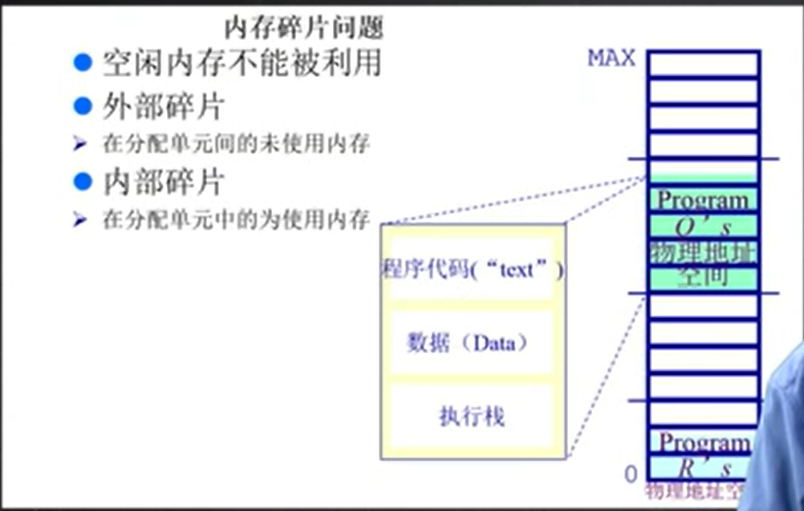

## 3.1 计算机内存分层体系

操作系统在分层的内存体系中，需要完成的事情是内存的置入和置出，一些CPU需要的东西需要放到CPU上跑，一些暂时不用的就可以挪出CPU

其次CPU寄存器掉电以后数据会丢失，这时候就需要将这些数据放到磁盘中进行永久保存

操作系统在内存管理中的目的是完成**抽象、保护、共享和虚拟化**

1. 抽象：通过抽象，用户无需考虑具体的地址在外设的什么地方，由操作系统完成物理地址→逻辑地址的映射

2. 保护：对于不同的进程，需要给独立的地址空间，避免不同的进程相互之间影响

3. 共享：进程之间可能需要交互，就需要进行进程中的数据传递

4. 虚拟化：在内存中放很多应用程序就会导致内存不够，这就需要虚拟化技术，用到的数据放到内存中，暂时不用的数据放到磁盘上

## 3.2 操作系统管理内存的方法

- 程序重定位

- 分段

- 分页

- 虚拟内存

- 按需分页虚拟内存

实际上，操作系统实现这些功能高度依赖于硬件，所以必须知道内存架构，期货中，MMU(内存管理单元)是一个硬件组件，负责处理CPU的内存访问请求

## 3.3 地址空间定义（逻辑地址与物理地址空间定义）

- **物理地址空间**：物理内存（包含主存+磁盘）的管理和控制是由硬件完成的

- **逻辑地址空间**：是一维的地址空间，是一个运行程序拥有的内存范围

## 3.4 地址生成（逻辑地址与物理地址的映射）

由操作系统负责建立逻辑地址与物理地址的映射，我理解流程如下：

1. 操作系统一开始就建立好了逻辑地址与物理地址之间的映射

2. CPU运算器需要逻辑地址所对应的物理地址中的内容

3. 内存根据操作系统建立的映射，获取真实物理地址

4. 控制器从总线上发起对真实物理地址的请求

5. 内存将物理地址中的内容返回给CPU

操作系统所谓的“建立逻辑地址和物理地址之间的映射”就是设置界限寄存器和基址寄存器

## 3.5 内存碎片与分区动态分配

内存碎片分为外部碎片和内部碎片，定义如上。

操作系统需要从硬盘中将程序加载至内存，这就涉及到了内存的分配，需要在内存中划分一块空间给内存（分配**程序占用的空间**）。除此之外还需要分配程序数据占用的一块**数据空间**。**操作系统需要管理空闲空间和非空闲空间，以为不同的程序分配内存**。

分配策略如下：

- **首次适配**：
  
  - 需求：
    
    - 按地址排序的空闲块列表
    
    - 分配需要寻找一个合适的分区
    
    - 重分配需要检查，看是否有空闲块能与相邻空间合并
  
  - 优势：
    
    - 简单
    
    - 易于产生更大空闲块
  
  - 劣势：
    
    - 容易产生外部碎片
    
    - 不确定性

- **最优适配**：
  
  - 为了避免分割大空闲块
  
  - 为了最小化外部碎片产生的尺寸
  
  - 需求：
    
    - 按尺寸排列的空闲块列表（这样比较容易找，小→大排序）
    
    - 分配需要寻找一个合适的分区
    
    - 重分配需要搜索及合并于相邻的空闲分区，若有
  
  - 优势：
    
    - 大部分分配是小尺寸时非常有效
    
    - 简单
  
  - 劣势：
    
    - 外部碎片
    
    - 重分配慢
    
    - 容易产生许多没用的微小碎片

- **最差适配**：
  
  - 与最优适配恰好相反
  
  - 避免过多微小碎片（最优适配的缺点）
  
  - 需求：
    
    - 尺寸排列、重分配调整
    
    - 分配很快（获得最大的分区，尺寸排列大→小排即可）
  
  - 优势：
    
    - 分配中等尺寸效果最好
  
  - 劣势：
    
    - 易于破碎大空闲块，导致大分区无法匹配
    
    - 外部碎片
    
    - 重分配慢

## 3.6 压缩式与交换式内存整理

**压缩式内存整理**：将内存中的所有程序压缩，从而腾出更大的空闲块

要考虑的是什么时候才能够移动这些程序？

- 程序在等待某个事件的时候才能够移动，而非在运行过程中移动，否则可能导致访问异常

**交换式内存整理**：将磁盘内存作为后备部分，如下图中P4在等待某个事件时，而P3又需要更多内存时，就可以将P4交换到磁盘中，将主存的更多空间分配给正在运行的P3

