## 4.1 连续内存分配的缺点

1. 分配给一个程序的物理内存是连续的

2. 内存利用效率低

3. 存在外碎片、内碎片的问题

## 4.2 非连续分配的优点（解决连续内存分配的缺点）

1. 程序物理地址空间非连续

2. 能更好地利用和管理内存

3. 允许共享代码与数据

4. 支持动态加载和动态链接

非连续分配下，需要考虑如何建立虚拟地址和物理地址之间的转换，有两种硬件方案：

- 分段

- 分页

## 4.3 分段寻址

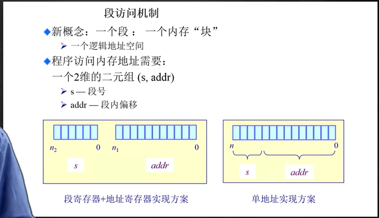

为了通过段号和段内偏移来获取物理地址，硬件实现上需要维护一个段表，段表中包括段的起始位置和段的长度限制，如下所示，这个段表由操作系统设置    

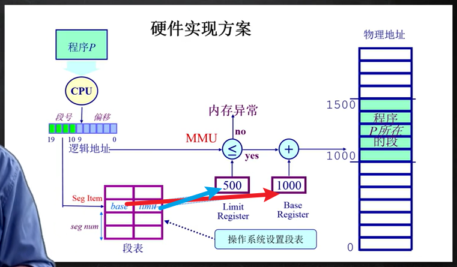

有了以上的实现后：

1. 可以根据逻辑地址中的段号，去段表中找到这个段的**起始地址，以及限制长度**。

2. 由MMU判断偏移长度是否大于限制长度：
   
   - 小于则合法寻址
   
   - 大于则内存异常

## 4.4 分页寻址

现在分页寻址实际用的更多。

分页寻址和分段寻址的区别在于：

- 段的长度通常是不同的，而**页的大小通常是固定的**，逻辑地址中的页和物理地址中页的大小是一致的

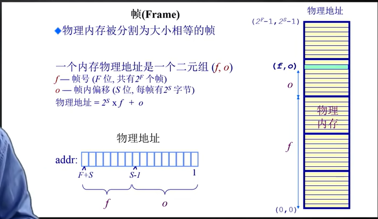

例子：16-bit地址空间，9-bit大小页帧。物理地址(3,6)实际对应多少？

9bit大小页帧实际上就是$2^9=512$byte大小的页帧

则物理地址=$2^9*3+6=1542$

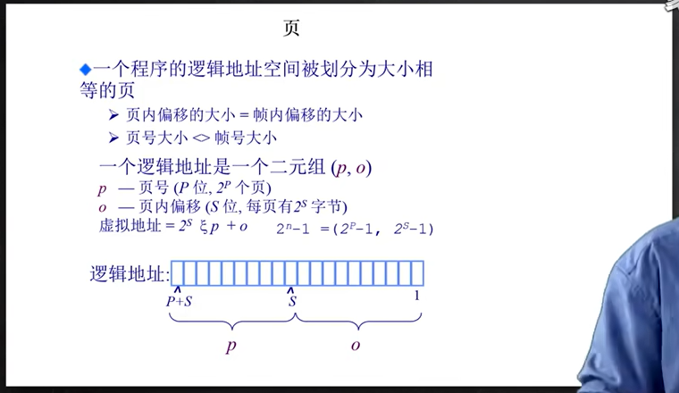

页寻址机制如下：

1. 逻辑地址中有(p,o)，其中p表示页号，o表示页偏移

2. 根据页号在页表中可以找到这个页对应的帧号f，则(f,o)就被用于寻找真实物理地址

3. 经(f,o)寻找真实物理地址公式=$2^S*f+o$，也就是**页大小×页数+偏移**

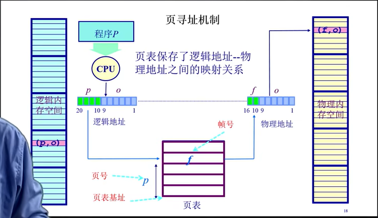

注意：逻辑地址空间 通常> 物理地址空间

分页逻辑地址到物理地址映射实际上是：

- 页映射到帧（逻辑页，物理帧）

- 页是连续的虚拟内存

- 帧是非连续的物理内存

- 不是所有的页都有对应的帧（虚拟存储时候）

通过这种机制**可以更好地利用碎片化的空间**

## 4.5 页表概述

注意：**每个运行的程序都有一个页表**

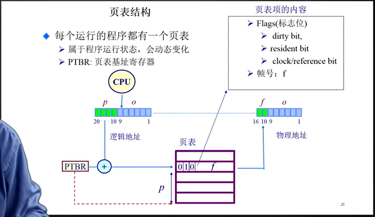

通过(p,o)中的p寻找帧号，实际上就是`页表[PTBR+p]`，页表项内容对应右上角，这些标志位可能表示的信息如下：

- 这个页是否能够映射到物理空间中，因为逻辑空间>物理空间，有的页不一定能映射过去

- 这个页最近有没有被读过/写过，这个是用于之后做一些置换的一个参考项

## 4.6 分页性能问题

1. 访问一个内存单元需要2次内存访问，第一次获取页表项，第二次访问数据 **（时间问题）**

2. 页表可能非常大，对于64位机器，每页1024个字节，一个页表的大小很大，并且多个程序可能有多个页表 **（空间问题）**

解决方案：

1. 缓存（将要访问的数据缓存在离CPU较近的地方）

2. 间接访问

## 4.7 分页性能时间问题解决方案——TLB

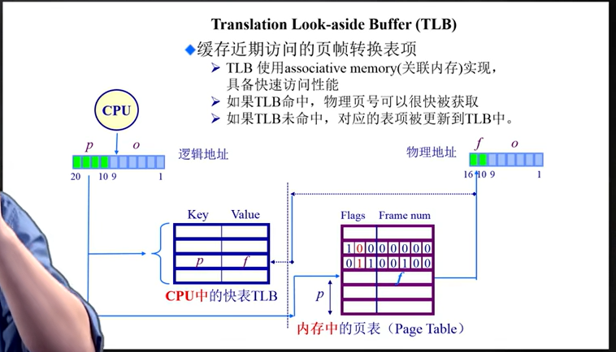

TLB未命中，将对应表项更新到TLB的过程是由谁来完成的，这是由CPU决定的，对于x86的CPU，这是由CPU自身直接控制硬件完成的

## 4.8 分页性能空间问题解决方案——二级，多级页表

传统的一级页表中，即使某些页面未被使用，其对应的页表项仍需保留，导致大量连续内存空间的浪费。而二级页表通过分层设计，仅在需要时加载实际使用的页表项到内存中，从而避免了为未映射或未使用的页面分配空间。

二级页表实际上就是把原本的页表稀疏化了，因为原本只有一次查页表的话，即使是没有映射的页表，它的页也要被保留，实际上有的页可能是不存在实际地址的，那通过这种二级页表的方式就可以抛弃掉那些没有映射的页表项，这些页表项也没必要占内存了。

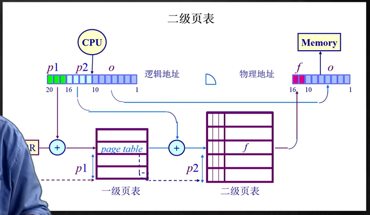

将二级页表进一步推广就得到多级页表，实际上就是时间换空间，虽然需要多次在内存中查表，但是很省空间。对于时间问题可以通过TLB进一步改进。

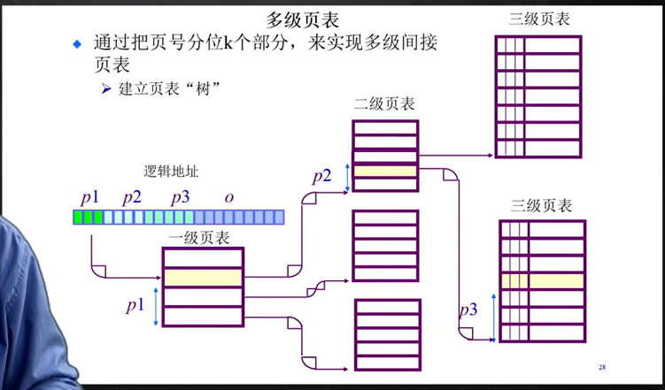

## 4.9 反向页表

前面的页表都是和逻辑空间建立的对应关系，逻辑空间越大，可寻址的范围越大，页表也就越大。

反向页表的出现，就是想要使得**页表和物理地址空间相对应**，而不是与逻辑地址空间，因为逻辑地址空间增长速度快于物理地址空间。

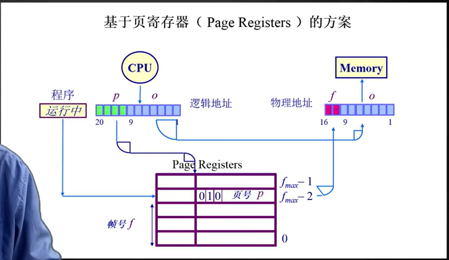

与原本的页表以页号作为index相反，反向页表中以帧号作为index。

**反向页表的利弊：**

好处：

1. 转换表的大小相对物理内存而言很小

2. 转换表大小与逻辑地址空间大小无关

3. 之前的页表每个进程都需要一个页表，这里整个系统只需要一个反向页表

坏处：

1. 反向页表根据帧号找页号，如何转换回根据页号找帧号？

**反向页表查找方式1：在反向页表中搜索页对应的帧号**

- 如果帧数较少，页寄存器可放置在关联内存中（TLB）

- 在关联内存查找逻辑页号，成功提取帧号，失败则页错误异常

- 限制：大量关联内存昂贵，这种查找难以在单个时钟周期完成

**反向页表查找方式2：基于哈希查找的方案**

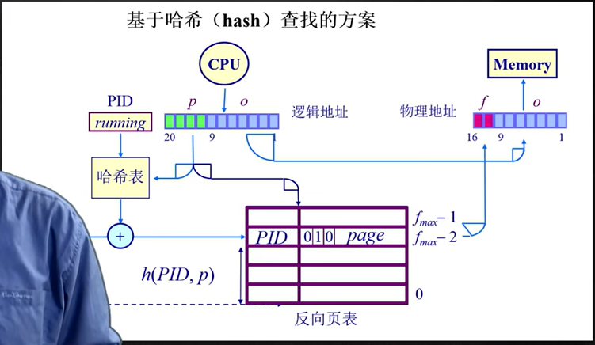

设计一个简单的哈希函数，将进程PID和页号p经过哈希函数h(·)映射到对应的帧号，哈希的运算过程可以使用**硬件**加速。

使用哈希需要考虑如下问题：

- 哈希碰撞，解决方案就是将进程PID作为哈希函数的输入，并使用哈希函数的输出作为页寄存器表的索引

- 使用哈希运算不能避免从内存中取结果的问题，所以同样需要使用TLB来提升查询速度，减少哈希运算次数
