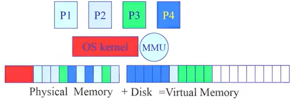
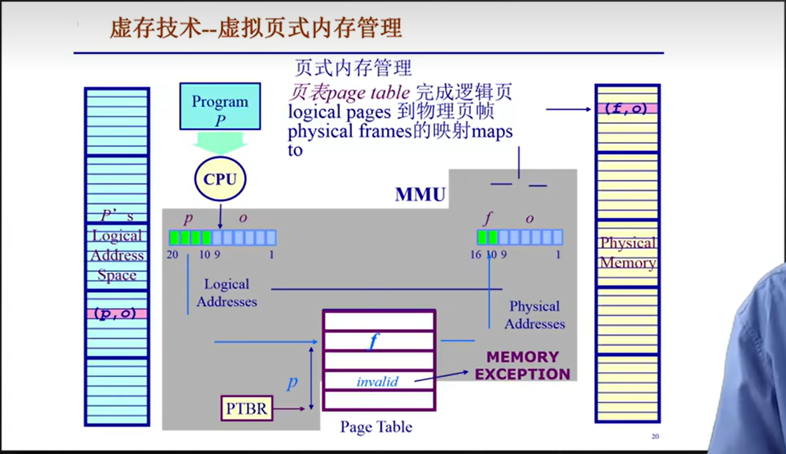
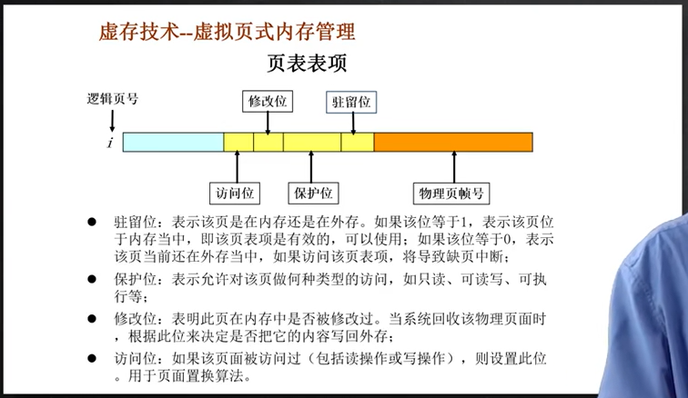
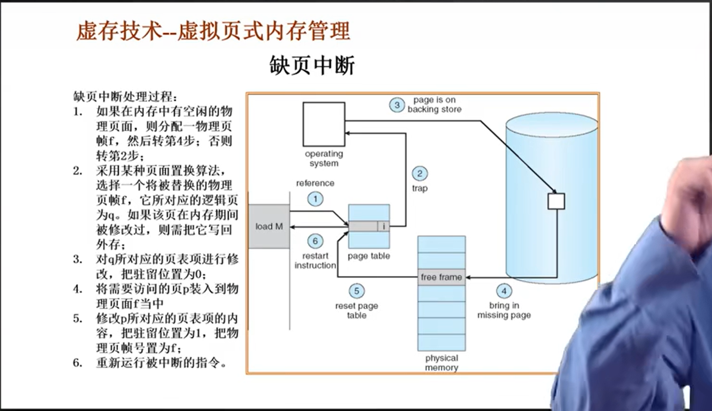

## 5.1 为什么需要虚拟内存

- 有的程序涉及到3d、动画的资源，需要较大的内存

- 理想中的存储器是<u>更大、更快、更便宜</u>的<u>非易失性</u>存储器

- 实际中大→硬盘，快→靠近CPU的存储器，不能同时满足

- 通过**操作系统**来实现**虚拟内存**，虚拟出一个理想存储器

虚拟内存的原理：常用数据&代码放入内存，不常用的放入硬盘

一些常见的虚拟内存技术：

## 5.2 覆盖技术

原理：

- 将程序按其逻辑结构，划分为若干个功能上相对独立的程序模块。**不会同时执行的模块将共享相同的内存区域，按时间先后顺序运行**（也就是轮流占用内存）
  
  - 必要部分（常用功能）的数据&代码常驻内存
  
  - 可选部分（不常用功能）在其他程序模块实现，平时存放在外存中，需要时装入内存
  
  - 不存在调用关系的模块不必同时装入内存，从而可以相互覆盖，即这些模块共用一个分区

例子：

缺点：

- 由程序员把大的程序划分为若干个小的功能模块，并确定各个模块之间的覆盖关系，费时费力，增加了编程复杂度；

- 覆盖模块从外存装入内存，实际上是以时间延长来换取空间节省

## 5.3 交换技术

原理：

- 将暂时不能运行的程序（e.g. 等待资源的程序）整个送到外存，从而获得空闲内存空间

- 操作系统把一个进程的整个地址空间的内容保存到外存（swap out换出），将外存中的某个进程的地址空间读入到内存中（swap in换入）。换入换出内容的大小为整个程序的地址空间。

实现上的问题：

- 交换时机确定：什么时候需要交换？仅当内存空间不够或有不够的危险时换出；因为硬盘速度和CPU速度差了很大数量级，频繁的换入换出会造成显著的卡顿

- 交换区的大小：必须足够大，以存放所有用户进程的所有内存映像的拷贝，必须能对这些内存映像直接存取；

- 程序换入时重定位：换出后再换入的内存位置一定要在原来的位置上吗？通过动态地址映射的方法（页表）可以避免一定要在原来位置的问题

## 5.4 覆盖技术与交换技术的区别

- 覆盖发生在程序内，由程序员手动去设定：覆盖只能发生在那些相互之间没有调用关系的程序模块之间，因此程序员必须给出程序内的各个模块之间的逻辑覆盖结构。

- 交换发生在程序间，由操作系统直接完成：以内存中的程序为大小进行的，且交换发生在内存程序与管理程序或操作系统之间

## 5.5 虚拟内存技术

**为什么需要虚拟内存技术？**

因为：覆盖技术和虚存技术都有各自的缺陷，覆盖技术需要程序员手动划分功能模块的覆盖关系，交换技术以进程作为交换单位，增加了处理器开销

**虚拟内存技术目标**：

- 像覆盖技术一样，无需将程序所有内容放在内存中，但无需程序员手动干涉；

- 像交换技术一样，能够实现进程在内外存之间的交换，但只需对进程的部分内容在内外存之间进行交换

**程序局部性原理**：

程序在执行过程中的一个较短时期，所执行的指令地址和指令的操作数地址，分别局限于一定区域，从而实现高效操作。具体表现为：

- 时间局部性：一条指令的一次执行和瑕疵执行，一个数据的一次访问和下次访问都在较短时期内

- 空间局部性：当前指令和邻近几条指令，当前访问的数据和邻近数据都集中在较小区域内

- 程序局部性原理表明理论上虚拟内存技术是能实现并能取得令人满意的效果的

**虚拟内存技术基本概念**：

可以在页式或段式内存管理基础上实现

- 装入程序时不必全部装入内存，只需将当前执行部分页面或段装入内存，就可以让程序开始执行

- 在程序执行过程中，如果需执行的指令或访问的数据没在内存（缺页/缺段），则由处理器通知操作系统将相应页面或段调入内存，并继续执行程序

- 另一方面，操作系统将内存中暂时不适用的页面或段调出保存在外存上，以腾出更多空闲空间存放将要装入的程序以及要调入的页面或段

**虚拟内存技术基本特征**：

- 大的用户空间：**通过把物理内存与外存相结合，提供给用户虚拟内存空间通常大于实际的物理内存**，即实现了这两者的分离。如32位的虚拟地址理论上可以访问4GB，而计算机仅有256MB的物理内存，但硬盘容量大于4G

- 部分交换：与交换技术相比，虚拟存储的调入和调出是对**部分虚拟地址空间**进行的

- 不连续性：物理内存分配的不连续，虚拟地址空间使用的不连续（原本说虚拟地址空间连续性指的是整个进程都放在虚拟内存中，但是由于虚拟内存技术的存在，可能只放了需要使用的部分）

## 5.6 虚拟页内存管理

页表中除了有页p对应的帧号f外，还有指明对应帧是否存在的二进制位（如下图所示），当查询到二进制位为0表示页表不存在，也就是缺页，此时要进行页的置换。

在虚拟页内存管理时，需要增加请求调页和页面置换的功能。**基本思路**如下：

- 用户程序调入内存运行时，不是将该程序所有页面都装入内存，而是只装入部分页面，就可以启动程序运行

- 在运行时，如果发现运行的程序或数据不在内存中时，则向操作系统发出缺页中断请求，操作系统处理中断会将相应页面调入内存，使得程序能继续运行

**具体置换流程**：

**后备存储Backing Store**：

- 虚拟地址空间中的页面可以映射到一个文件中的某个位置

- 代码段：映射至可执行二进制文件

- 动态加载的共享库程序段：映射到动态调用的库文件

- 其他段：临时产生的内容，可能被映射到交换文件（swap file）

**Effective memory Access Time(EAT)有效存储器访问时间**：

EAT=访存时间\*页表命中几率+page fault处理时间\*page fault几率

e.g. 访存时间可能是10ns，磁盘访问时间可能是5ms，二者之间是5~6个数量级的差异

命中几率越高，整体时间越小，凭借程序局部性原理，可以保证有效存储器访问时间(EAT)较低
