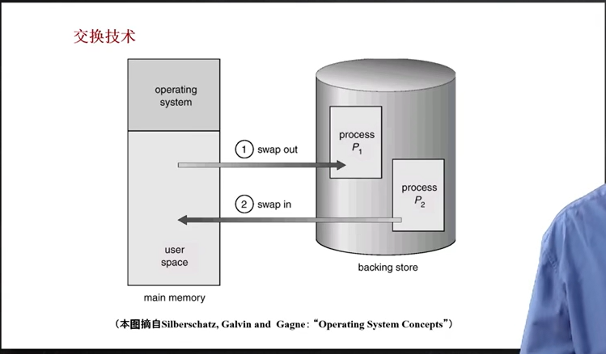

## 5.1 为什么需要虚拟内存

- 有的程序涉及到3d、动画的资源，需要较大的内存

- 理想中的存储器是<u>更大、更快、更便宜</u>的<u>非易失性</u>存储器

- 实际中大→硬盘，快→靠近CPU的存储器，不能同时满足

- 通过**操作系统**来实现**虚拟内存**，虚拟出一个理想存储器

虚拟内存的原理：常用数据&代码放入内存，不常用的放入硬盘

一些常见的虚拟内存技术：

## 5.2 覆盖技术

原理：

- 将程序按其逻辑结构，划分为若干个功能上相对独立的程序模块。**不会同时执行的模块将共享相同的内存区域，按时间先后顺序运行**（也就是轮流占用内存）
  
  - 必要部分（常用功能）的数据&代码常驻内存
  
  - 可选部分（不常用功能）在其他程序模块实现，平时存放在外存中，需要时装入内存
  
  - 不存在调用关系的模块不必同时装入内存，从而可以相互覆盖，即这些模块共用一个分区

例子：

缺点：

- 由程序员把大的程序划分为若干个小的功能模块，并确定各个模块之间的覆盖关系，费时费力，增加了编程复杂度；

- 覆盖模块从外存装入内存，实际上是以时间延长来换取空间节省

## 5.3 交换技术

原理：

- 将暂时不能运行的程序（e.g. 等待资源的程序）整个送到外存，从而获得空闲内存空间

- 操作系统把一个进程的整个地址空间的内容保存到外存（swap out换出），将外存中的某个进程的地址空间读入到内存中（swap in换入）。换入换出内容的大小为整个程序的地址空间。

实现上的问题：

- 交换时机确定：什么时候需要交换？仅当内存空间不够或有不够的危险时换出；因为硬盘速度和CPU速度差了很大数量级，频繁的换入换出会造成显著的卡顿

- 交换区的大小：必须足够大，以存放所有用户进程的所有内存映像的拷贝，必须能对这些内存映像直接存取；

- 程序换入时重定位：换出后再换入的内存位置一定要在原来的位置上吗？通过动态地址映射的方法（页表）可以避免一定要在原来位置的问题

## 5.4 覆盖技术与交换技术的区别

- 覆盖发生在程序内，由程序员手动去设定：覆盖只能发生在那些相互之间没有调用关系的程序模块之间，因此程序员必须给出程序内的各个模块之间的逻辑覆盖结构。

- 交换发生在程序间，由操作系统直接完成：以内存中的程序为大小进行的，且交换发生在内存程序与管理程序或操作系统之间

## 5.5 虚拟内存技术

