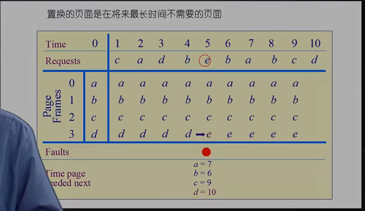
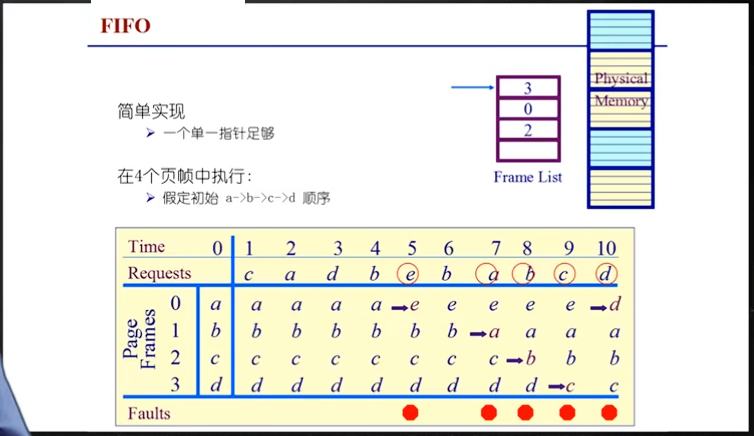
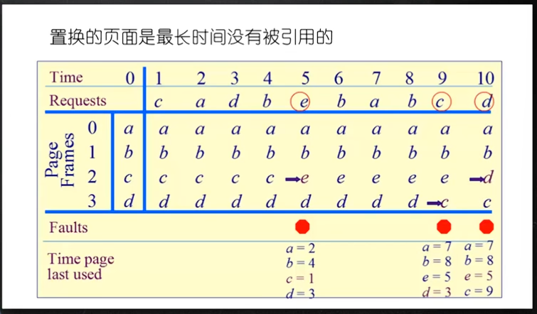
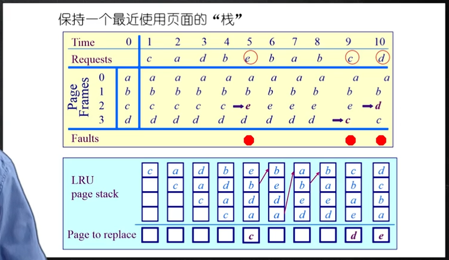
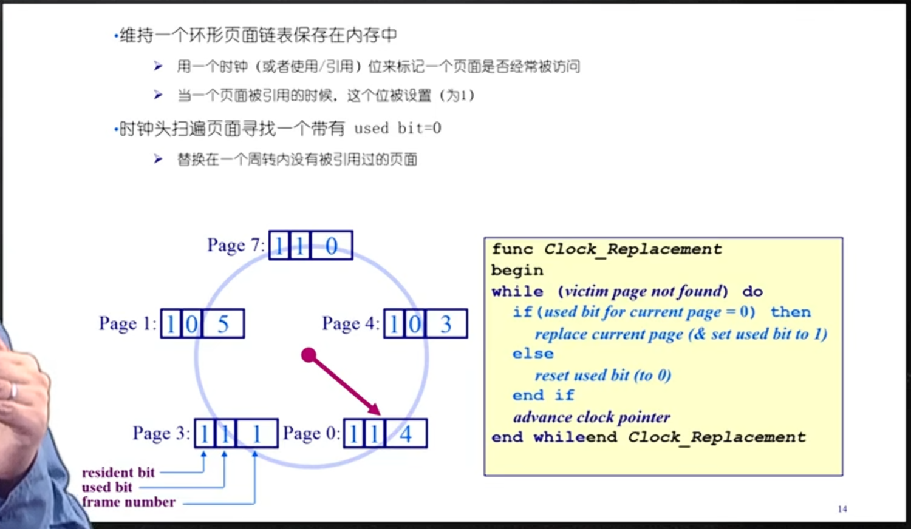
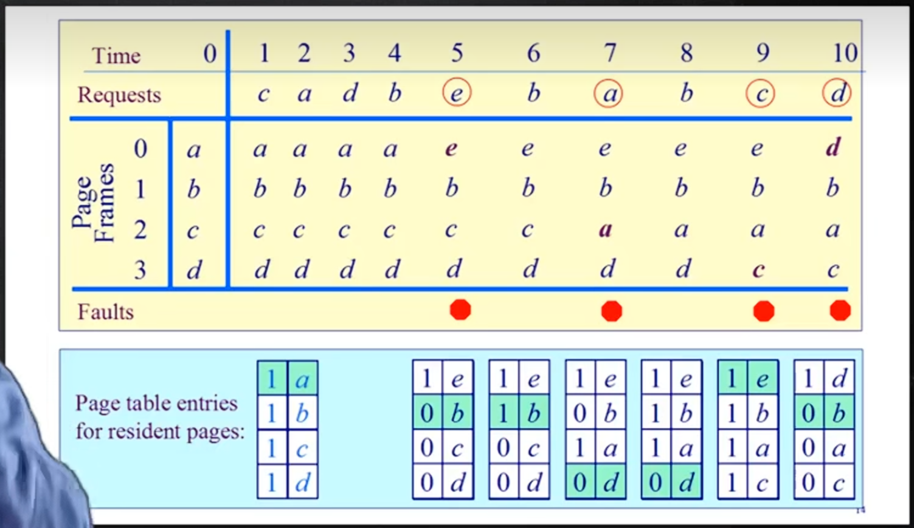
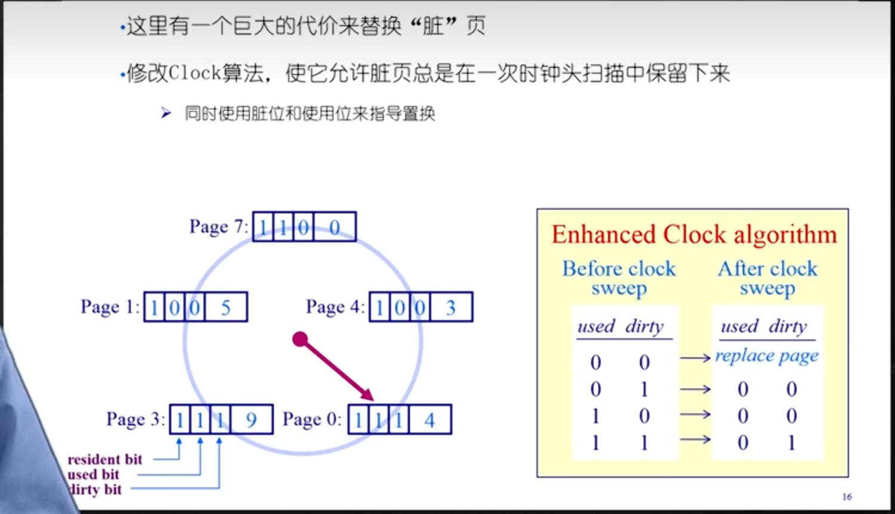
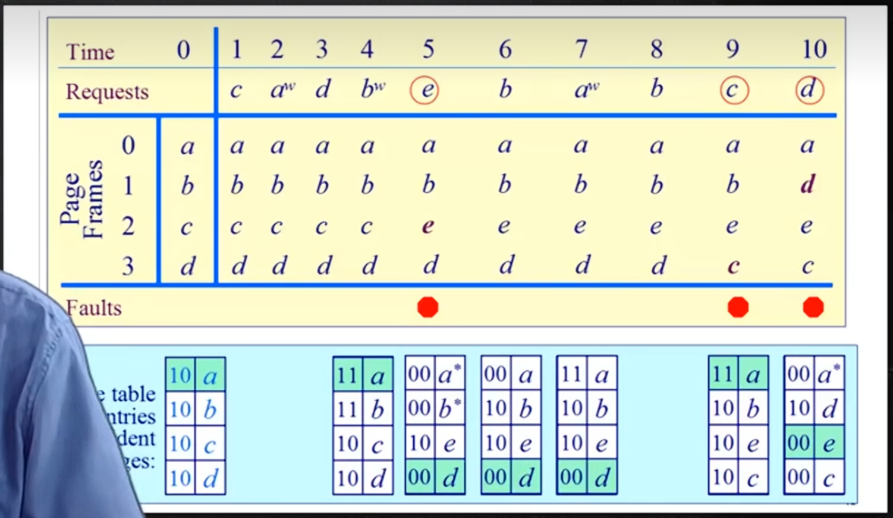

## 6.1 最优页面置换算法

**页面置换算法的目标**：尽可能减少页面的换入换出次数（即减少缺页中断次数）

**页面锁定**：用于描述必须常驻内存的操作系统的关键部分或时间关键的应用进程。实现方法：页表中添加锁定标志位lock bit

**基本思路**：当一个缺页中断发生，对于保存在内存当中的每一个逻辑页面，计算其在下一次访问之前还需等待多长时间，选择等待时间最长的座位被置换的页面

这种算法仅是理想情况，实际系统无法实现，因为操作系统没办法知道每个页面要等多长时间后才会被访问。但这种算法可以作为其他算法的性能评价依据。

## 6.2 先进先出算法（FIFO）

**基本思路**：

- 选择在内存中**驻留时间最长**的页面并淘汰

- 系统维护一个链表记录了所有位于内存当中的逻辑页，从链表排列顺序来看，链表首部页面驻留时间最长，链表尾部页面驻留时间最短

- 发生缺页中断时淘汰链表首页，将新页添加至链表末尾

- 问题：**性能差**，调出页面可能需要经常访问，有Belady现象（见6.7），使用较少

## 6.3 最近最久未使用算法（LRU）

**基本思路**：缺页中断发生时，淘汰最久未使用的页面

这是对最优页面置换算法的近似，依据程序局部性，最近一段时间内如果某些页面被频繁地访问，则将来一小段时间内极有可能再一次被频繁访问。反过来说，如果某些页面长时间未被访问，则将来还可能长时间不被访问。

**实现方法**：

- 系统维护一个页面链表，最近刚使用的页作为首节点，最久未使用页作为尾节点。每次访问内存找到相应页面，从链表中摘下来，移到链首。每次缺页中断淘汰链表尾部页面。

- 设置活动页面栈，访问某页时将该页压入栈顶，然后考察栈内是否有与此页面相同的页号，若有则抽出。当需要淘汰一个页面时总是选择栈底的页面，它就是最久未用的

- **LRU的实现起来开销很大，也不是特别理想的算法**

## 6.4 时钟页面置换算法

这是LRU的近似，是对FIFO的一种改进

**基本思路：**

- 需要用到页表项中的访问位，当一个页面被装入内存，将该位初始化为0，当这个页面被访问（读/写）则置1（**置1的过程由硬件完成**）

- 把各个页组织成环形链表（类似钟表面），指针指向最老的页（最先进来的页）

- 当发生缺页中断，考察指针所指向的最老页面，若它的访问位为0，立即淘汰；访问位为1，则置0，并将指针向后移动一格，直到找到被淘汰的页面，将指针移动到它的下一格

假如缺页，Page0就会变成104，Page3变成101，Page1被替换，移动到Page7

实际例子如下：

## 6.5 二次机会法

通过dirty bit位（读为0，写为1）来提升时钟页面置换算法，二次机会法也称为enhanced clock算法。

**原理**：刚被写过的页和刚被读过的页，优先替换仅被读的页，因为替换写的页还需要将数据写会磁盘中，时间成本更高。

例子如下：

